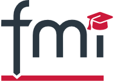

# FMI Beginner's tutorial

This repository contains the agenda and materials for the FMI Beginner's tutorial presented at the [SIMULTECH 2024](https://simultech.scitevents.org/) conference. 

## Part 1: Introduction to the FMI (40 min)

by [Christian Bertsch](https://github.com/chrbertsch)

[Presentation](part1/Introduction-to-FMI.pdf) covering

1. the motivation and history of FMI
2. general technical concepts
3. tool support
4. an outlook on FMI 3.0
5. FMU export (from Dymola)
  1. open `MODELICA_Demo.Drive` in Dymola and export it as a source code FMU
6. FMU export (from Simulink with FMIKit)
  1. download and install FMI Kit for Simulink
  2. open `Controller.slx` with grtfmi.tlc as a source code FMU

## Part 2: Working with FMUs (45 min)

by [Claudio Gomes](https://clagms.github.io/)

### Prerequisites

- [Python with fmpy[complete]](https://github.com/CATIA-Systems/FMPy#installation)
- [Dymola](https://www.3ds.com/products-services/catia/products/dymola/) (optional)
- [Simulink with Coder](https://mathworks.com/products/simulink-coder.html) and [FMI Kit](https://github.com/CATIA-Systems/FMIKit-Simulink) (optional)

### Schedule

Live demo + Jupyter notebook

1. Validation of FMUs on the Website
2. work with FMUs in FMPy
  1. set up FMPy (with [mambaforge](https://github.com/conda-forge/miniforge/releases))
  2. open GUI, create file association, create desktop shortcut
  3. view the model info
  4. view the documentation
  6. simulate the Drive FMU and plot the result
  7. create an input CSV file
  8. set the stop time, parameters, output interval (loadInertia1.J = 10)
  9. validate the Drive FMU 
  10. compile platform binary for the Drive FMU
  11. log debug info and FMI calls + short discussion of FMI calling sequence
  12. generate a Python notebook from the FMU and run it
3. simulate an FMU with fmusim
  1. download the Reference FMUs
  2. simulate the Drive model with fmusim using the input file and set a parameter
  3. plot the result CSV with Excel

## Q&A (10 min)

## Break (30 min)

## Part 3: Connecting Multiple FMUs (45 min)

by [Maurizio Palmieri](https://github.com/mapalmieri)

### Prerequisites

1. Optional requisites for following along in the live demo:
   1. Java (recommended version 11)
   2. Install the into-cps application. A full guide can be found in this video: https://youtu.be/HkWh-PubYQo
   3. Have a Google account that you can use for Google Colab.

### Schedule

1. Live demo using the into-cps application (use the [slides](./part3/into-cps_demo.pptx) to follow along):
2. Setup
   1. Pre-requisites: show that java is installed.
   2. Download intocps application
   3. Download coe from download manager.
   4. Launch COE from UI to show that it works.
3. Configure a multimodel
   1. Create new project (created project can be found in [part3/example_intocps_app](part3/example_intocps_app))
   2. Locate FMUs to be used.
   3. Move them to new project folder.
   4. Create multi model
4. Configure a co-simulation
   1. Create cosim configuration.
   2. Explain the different options.
   3. Run it.
   4. Open the results folder
5. Exploring alternative co-simulation configurations.
   1. Create new cosim config, with an increasing step size, and show instability creeping in.
6. Summary
7. Using Google Colab, run the Jupyter notebook found in [part3/tutorial_multiple_FMUs](./part3/tutorial_multiple_FMUs/interaction_with_multiple_fmus.ipynb)
8. Run a co-simulation from the command line
   1. Run a co-simulation with a single FMU
   2. Run a co-simulation with multiple FMUs
9. Measure Accuracy of the Co-simulation Wrt to Baseline
    1. Co-simulation Scenario with Baseline
    2. Impact of Step Size on the Accuracy   

## Part 4: Closing Session (10 min)

by [Maurizio Palmieri](https://github.com/mapalmieri) and [Cláudio Gomes](https://github.com/clagms)

Slides can be downloaded [here](./part4/FMI-overall.pdf).

### Schedule
1. Overview of some FMI Applications
2. Role of FMI in Digital twins.

## Q&A (10 min)

# Copyright and License

Code and documentation copyright (C) 2023 the Modelica Association Project FMI.
Code released under the [2-Clause BSD License](https://opensource.org/licenses/BSD-2-Clause).
Docs released under [Attribution-ShareAlike 4.0 International](https://creativecommons.org/licenses/by-sa/4.0/).
